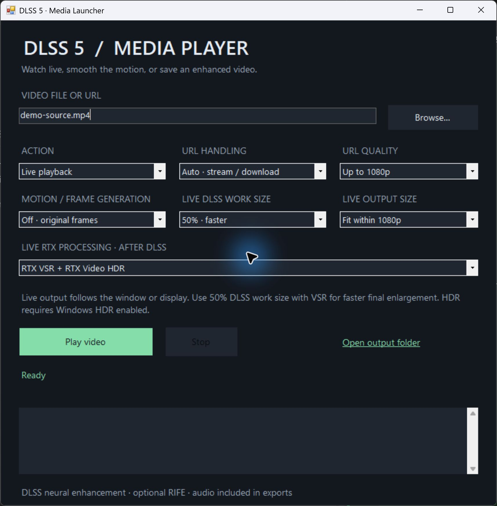
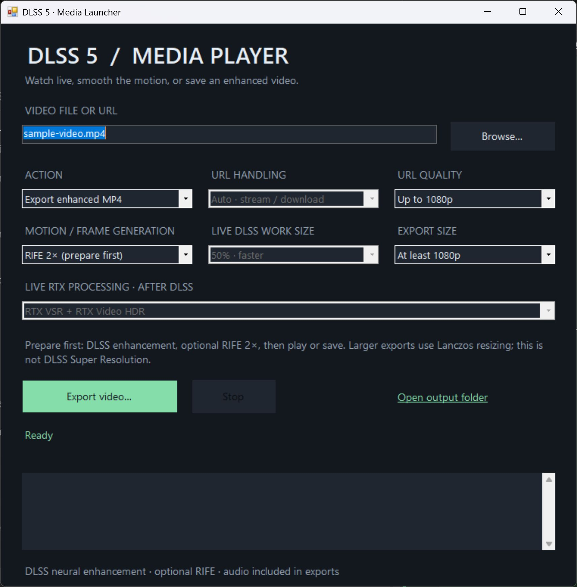

# DLSS Media Player

Windows media player for local videos, URLs, online videos, and live streams, with experimental DLSS neural enhancement, RTX Video HDR and rendered-frame buffering, and optional offline RIFE frame generation.

## Screenshots

| Live playback | Export with RIFE |
| --- | --- |
|  |  |

Click either screenshot for the full-size view. These original screenshots show the earlier interface; the current version retains HDR, removes VSR modes, and adds render buffering.

## Live playback

Open `DLSS-Media-Launcher.exe`. Select **Live playback** for a file or URL. Twitch and other URLs recognized by an installed Streamlink plugin automatically use Streamlink. **Streamlink live** also allows explicit selection and Streamlink protocol URLs.

- **Live Output Size**: fit the window, fit within 1080p/1440p/2160p, or **Display · fullscreen**. Press F to return to a window. Aspect ratio is preserved. Fixed fit sizes are window bounds, not encoded dimensions.
- **RTX Video HDR**: Off or HDR. VSR modes have been removed. HDR requires Windows HDR on the playback display.
- **Live DLSS Work Size**: **100% full quality** is the default. 75% and 50% reduce neural work dimensions.
- **Motion**: original frames or MPV display smoothing. RIFE remains an offline option.
- **Render Buffer**: Off, 5, 10, 20 or 30 seconds of enhanced frames. This is an experimental separate rendering engine, described below.

Normal playback scales in MPV, applies DLSS neural enhancement, then optionally converts SDR BT.709 to HDR on GPU textures. No rendered-video intermediate is needed in this mode. HDR failures fall back to SDR. Native HDR material is tone-mapped to SDR first when RTX HDR is selected; this mode is primarily intended for SDR sources.

### Render-ahead playback

With **Render Buffer** enabled, acquisition, neural rendering and playback run independently:

`source → short chunks → persistent DLSS worker → completed enhanced-video queue → MPV → optional HDR`

MPV receives encoded frames that have already been enhanced. Its live DLSS pass is bypassed. The selected buffer is a target amount of **completed enhanced video**, not downloaded source data. Playback waits for that target, then pauses/refills if enhanced output runs out. A short finite clip can start with less than the target after rendering finishes.

The worker retains its GPU device/model between chunks. The activity log reports chunk throughput as a multiple of realtime: **1.5×** can gain buffer, **0.7×** will eventually need another refill. Task Manager's overall GPU percentage does not measure the latency of the pipeline's GPU waits. Buffering absorbs temporary stalls; it cannot guarantee continuous playback when sustained rendering is slower than the source.

Files are read ahead in bounded chunks. Recognized Streamlink URLs use live capture automatically, including with buffering enabled. Other yt-dlp URLs download first in buffered mode. Source URLs, authentication and site restrictions remain subject to Streamlink/yt-dlp support.

At 100%, the source is conventionally scaled to the selected output bounds **before** neural enhancement, preserving aspect ratio. At 75%/50%, neural work uses smaller dimensions and the enhanced result is spatially resized to the output bounds. Fit player window uses source dimensions in buffered mode; changing the window does not rerender cached frames. These are neural enhancement paths, not a claim of native DLSS Super Resolution.

The buffered worker preserves neural history across consecutive chunks, resets history at detected scene cuts, and disables synthetic camera jitter with a flat depth guide. Segment timing uses rendered frame counts rather than audio-padded container durations. Normal and buffered playback share MPV display-smoothing options. Normal playback already keeps its neural renderer loaded between frames.

Tradeoffs: startup delay, temporary NVENC encoding/decoding and SDR 8-bit cached video. The buffered renderer still uses a different guide-generation path from normal live playback; visual parity and elimination of temporal warping are not established. HDR runs during presentation and is not cached; stalls caused by HDR/display processing can still occur. Seeking, subtitles, additional audio tracks and source format changes are not supported by this experimental queue. Use normal playback for HDR sources. A format change requires restarting buffered playback. Live capture cuts at keyframes, so actual buffer duration can exceed the selection.

Temporary files live in `Cache/playback` and are deleted on normal completion/Stop. Rendering and completed-output queues are bounded; capture stops at approximately 4 GB of temporary data or below 1 GB free disk space. Forced termination can leave a cache directory. One offline/buffered neural job runs at a time.

## Prepare and export

Choose **Prepare enhanced & play** or **Export enhanced MP4**, optionally enable **RIFE 2×**, and select **Export Size**. Live modes display a separate Live Output Size control.

Offline exports use DLSS neural enhancement, optional Vulkan RIFE, NVENC encoding and source audio. Enlarged exports currently use Lanczos after enhancement, **not DLSS Super Resolution**. RTX HDR is not baked into exports. Ordinary inputs skip a redundant timing re-encode; variable-rate inputs become constant cadence during decoding.

Stop cancels helpers and removes partial exports. Existing destinations are never overwritten. Downloads, exports, temporary files, videos, binaries, and local settings are excluded from Git.

## Images

Choose **Enhance image (PNG)** and open a local image or paste a direct HTTP(S) image URL. Choose an export size and save the enhanced PNG. Browsing to an image selects this action automatically. PNG, JPEG, WebP, BMP, TIFF, AVIF, and GIF inputs are accepted through FFmpeg; animated images use their first frame.

Images use the verified offline DLSS neural renderer, retain transparency, and preserve source dimensions unless a larger output is selected. Larger output uses Lanczos after neural enhancement. The renderer uses a temporary encoded intermediate, so the result is not a lossless pixel round-trip. VSR, HDR, and frame generation are not used for this action. Image URLs must point directly to an image and downloads are limited to 100 MB.

## Build and setup

See [BUILDING.md](BUILDING.md) for runtime dependencies and build commands, and [Launcher-Guide.md](Launcher-Guide.md) for usage. This is a source repository; NVIDIA models and third-party executable distributions must be provisioned separately. [Third-party notices](THIRD_PARTY.md).

## Verification

Tested on RTX 5070 Ti 16 GB, driver 616.64:

- Render-ahead playback: verified neural output, HDR-only presentation, audio, EOF, cancellation and cleanup. See [buffer verification](verification/render-buffer.md).
- Historical Twitch live DLSS/RTX tests are retained in verification; VSR has since been removed.
- RIFE: 144 frames became 288 at 48 fps, retaining six-second duration and audio across a chunk boundary.
- Variable-rate input, 90-degree rotation, and cancellation during RIFE.
- Short 1080p benchmark: native DLSS 11.2 → 8.5 seconds; complete DLSS + RIFE export 22.7 → 14.3 seconds. Single runs; performance varies.

This is experimental community integration. Video uses estimated motion/depth guides and visual quality varies. It does not implement DLSS Frame Generation. RIFE retains image-file overhead. The live test had a transient audio underrun; sustained glitch-free playback at every resolution is not established.
